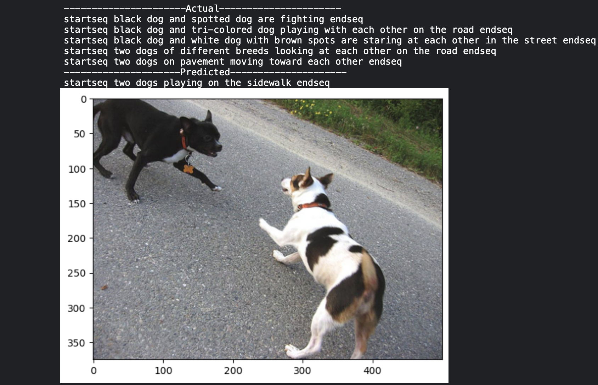
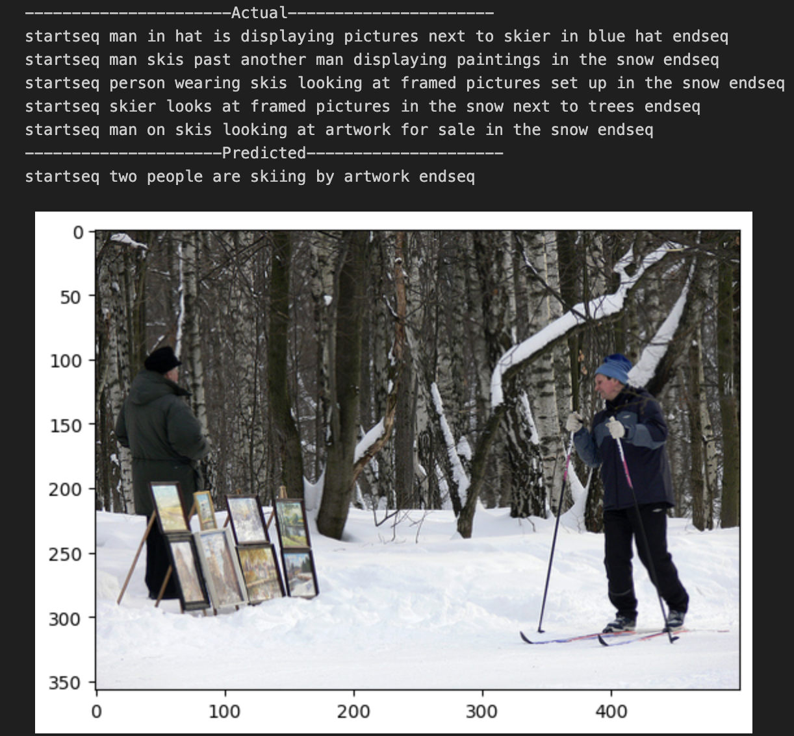

# Image Caption Generator

The objective of this project is to predict captions for an input image. The features from the image and text captions are extracted for input in the encoder model. Afterwards, the features are concatenated in the decoder model in order to predict the next word of the caption. A CNN is used for the images while an LSTM network is used for the texts.
BLEU Score was added as a metric to evaluate the performance of the model.

The dataset that provided the inputs for this project is the [Flickr Dataset](https://www.kaggle.com/datasets/adityajn105/flickr8k). The Flickr dataset consists of 8k images and 5 captions for each image.

